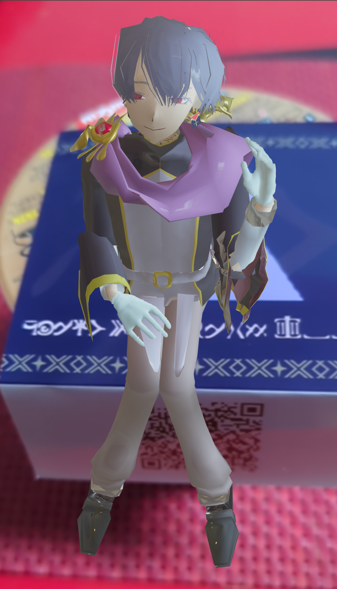
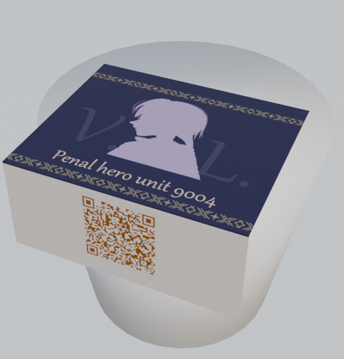
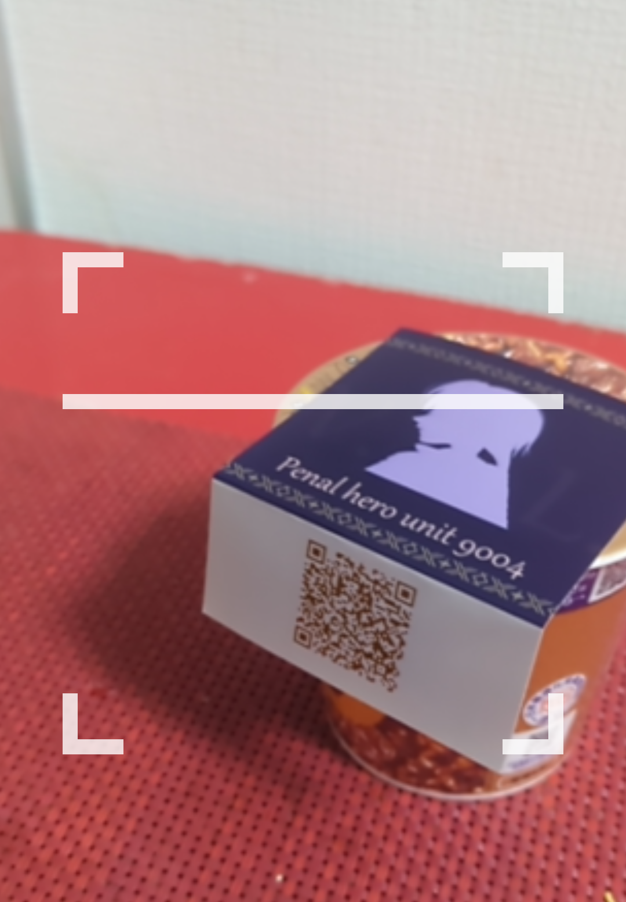
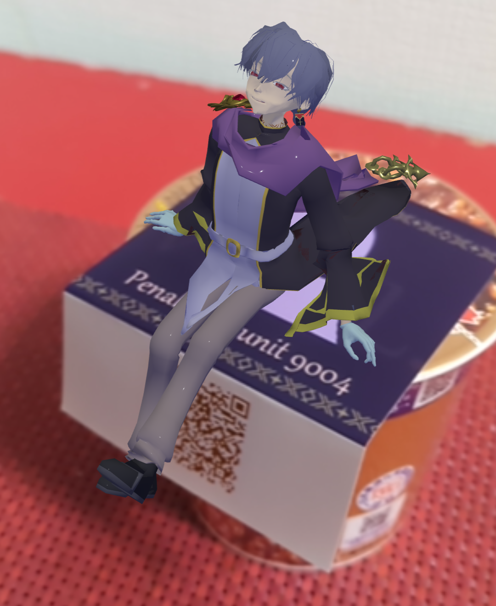
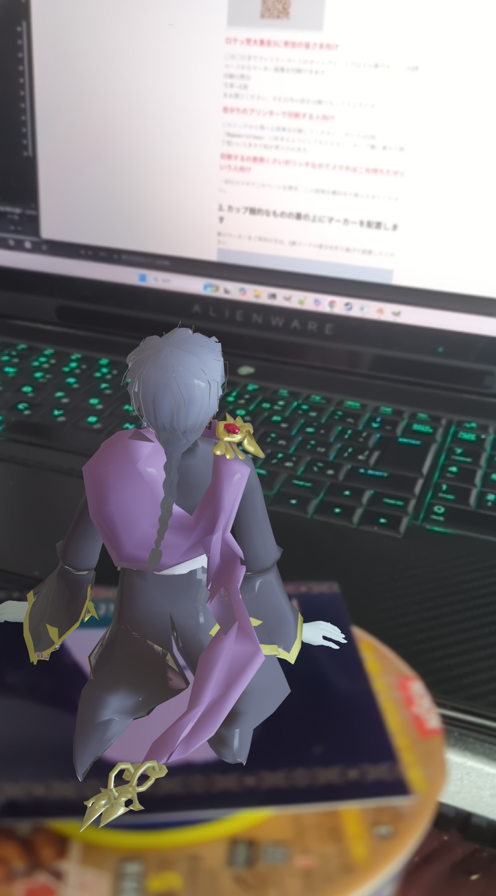
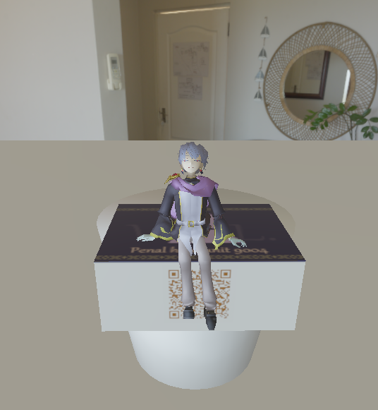

# ベネティム・レオプールの エアヌードルストッパー￥0で発売中!!

## 注意!!
このヌードルストッパーは詐欺です。  
奴には体重がなく、マーカー用紙一枚分の重さしかカップの上に載せられません。  
ヌードルストッパーとしてご利用の際は別途何かの重しをご用意ください。

## 必要環境
カメラとブラウザを利用できる電子機器（スマホ等）。  
プリンターもしくはお近くのファミマ。

## 使い方
### 1. まずマーカー画像を用意します。
<picture></picture>

#### ロケッ党大集会3に参加の皆さま向け
2026年07月30日 08時頃までにファミリーマートのネットプリントで[このリンク先](./netprint.html)の番号もしくはQRコードからマーカー画像を印刷できます。  
印刷の際はサイズ設定でL版をお選びください。  
それ以外の設定は触らなくて大丈夫です。  
用紙の指定はありませんが、写真紙が無難だとは思います。

#### 自分ちのプリンターで印刷する人向け
[このリンクから飛べる画像](../images/target.png)を印刷してください。 
サイズはL版（89mm×127mm）に収まるようにしてもらえると、カップ麺に乗せた際丁度いい大きさで奴が表示されます。  

#### 印刷するの面倒くさいがリッチなのでスマホは二台持ちだぜという人向け
一台のスマホでこのページを開き、[この画像](../images/marker.png)を横向きで表示させてください。

### 2. カップ麺的なものの蓋の上にマーカーを配置します
紙のマーカーをご利用の方は、QRコードの部分を折り曲げて設置してください  

スマホをご利用の方はスマホを直に置いてください 

### 3. カメラ付きスマホを用意します
マーカー画像の下部についているQRコード、もしくは下にあるQRコードから飛べるページに飛んでください。（2台使いの場合はマーカー画像を表示していない方）  
  
QRコードから飛べない場合は[こちら](../index.html)へ飛んでください。  
カメラの利用許可を求められた場合は許可を出してください。

### 4. カメラでマーカー画像を映してください
上手く行けば読み込み中の白枠が消えて、奴が表示されます。  
  
  
横からだと認識しにくいのですが、真上だと奴の頭しか見えなくなるので、斜め上から映すのをお勧めします。

### 5. 奴がカップ麺の蓋の上でくつろぎはじめます
多分。
  

## 上手く行かない場合の対処法

### 1. 表示自体されない場合
動作確認はAndroidとPCのChromeで行っています。ブラウザを最新のChromeに変えれば上手く行くかもしれません。  

### 2. 位置やサイズが合わない、斜めになる等の場合
マーカーを誤った位置で読み込んでいる可能性があります。  
一度マーカー画像をカメラの外に追いやってから、再度映しなおしてみてください。  
あるいはマーカー画像そのもののサイズが大きすぎると、奴もでかくなりますので、マーカー画像のサイズに調整が必要かもしれません。  
スマホにマーカーを表示させている場合は、拡大縮小で微調整してみてください。

### 3. カメラがある電子機器を持っていない場合
残念ながらあなたのお部屋に召喚する事は出来ませんが、Google Chrome 9以降、Firefox 4以降、Opera 15以降、Safari 5.1以降、Internet Explorer 11、MicrosoftEdge等であれば[このビューワー](../viewer.html)で奴を観察する事は出来ます。 
  
マウス操作やスワイプ等で拡縮や回転が出来ます。  
AR版だとマーカーを写さないといけない関係上見えにくい角度からも観察できますので是非ご利用ください。

### 4. ブラウザがある電子機器をお持ちでない場合
多分念力かなにかでこのページを見ていると思われますので、その念力をアップデートしてWebGL対応させてください。

### 5. 私より詳しい人向け
こちらはMindAR 1.2.5でGithub pages上で実装されています。  
バグを潰せるプルリクがありましたら受付るかもしれません（気づいた場合は）
